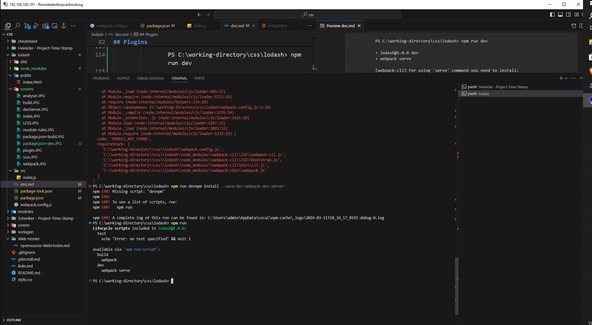

## lodash
-   wir beginnen mit erstellen des src Source Ordners
-   erstellen eine index.js Datei

        console.log('Hello World')

-   wenn der nodes.js auf dem Host installiert ist, führen wir den Befehl aus:

        npm init -y

-   dadurch wird eine JSON Datei erstellt

        npm install lodash

-   damit installieren  wir lodash zu den "dependencies" in der **JSON Datei** "Version 4.17.20"

-   wir erzeugen einen **public** Ordner mit einer **index.html**

-   mit folgendene Befehl weisen wir die Packages zu, dass Sie vom Browser gefunden werden können

        npm install --save-dev webpack webpack-cli web

-   wir fügen in der **package.json** Datei das build hinzu

-   webpack will analysed the CODE mit:

        npm run build

-   nachdem es analysiert wurde wird ein **dist** Ordner aktiv

-   wir binden den src Code im Header ein :

        <script src ="../dist/main.js>

-   wir erstellen eine **webpack.config.js** Datei & fügen folgende Zeile hinzu

## Loader
-   wir erstellen eine S-CSS Datei & und importieren diese mit:

        import './style.scss' ;

-   wir führen folgenden Befehl aus um in den Modus **developement** zu wechseln
                
        webpack --mode development

-   wir erkennen, dass ein Fehler erzeugt wird :

        you need an appropriate loader to handle this file...

-   auf der folgenden WebSite  [Link](https://webpack.js.org/)
finden wir die DOM Loader optionen
-   wir installieren unter anderen den [Style-Loader](https://webpack.js.org/concepts/loaders/)
        

    .

        npm install sass-loader css-loader ts-loader style-loader --save-dev
        

-    um LESS zu verwenden installieren wir den pre-Processor mit:

         npm install less-loader --save-dev
.
       

-   wir schreiben in die webpack.config.js folgende Befehle:

## Plugins

-    wir führen den folgenden Befehl aus, um den Bundle - Analyser zu installieren

        
                npm install --save-dev webpack-bundle-analyser
.

                const BundleAnalyserPlugin = require ('webpack-bundle-analyser').BundleAnalyserPlugin ;

.

-   wir installieren einen dev-server mit:

                npm install --save-dev-webpack-dev-server

-    wir fügen in der package.json folgende Zeile hinzu:

                    "dev"  : "webpack serve"
.

- wir führen den nächsten Befehl aus:

                PS C:\working-directory\css\lodash> npm run dev

                > lodash@1.0.0 dev
                > webpack serve   

                [webpack-cli] For using 'serve' command you need to install:
                            'webpack-dev-server' package.
                
                [webpack-cli] Would you like to install 'webpack-dev-server'
                            package? (That will run 'npm install -D webpack-dev-server') (Y/n) y

.

## dev npm  bugfix

                npm install webpack-bundle-analyzer --save-dev -force

                npm install webpack-node-externals --save-dev

